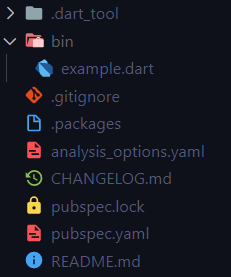
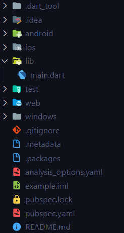
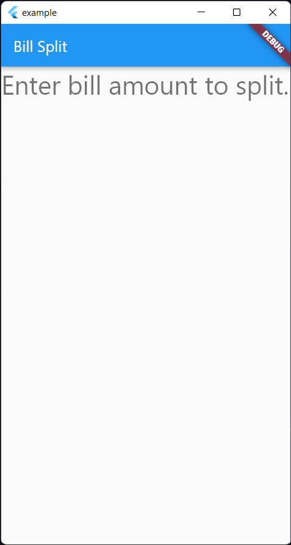
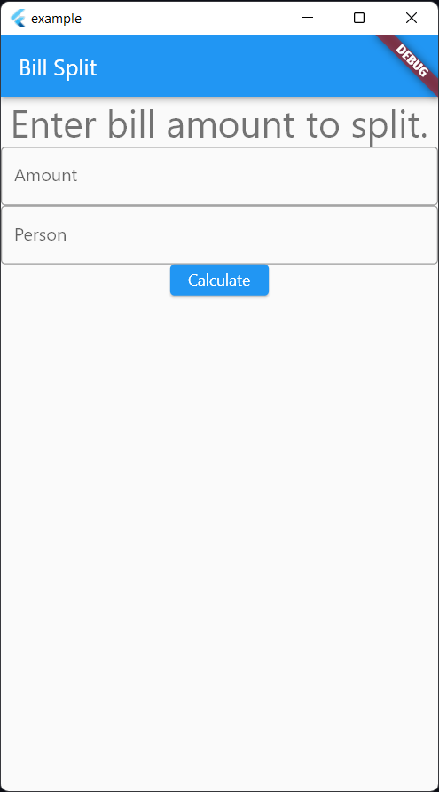

# Outline

- Who am I?
- What is Dart?
- Basics of Dart with comparative learning
  - Variables
  - Datatypes
  - Functions
  - Classes
  - Null safety
- Project
  - What is pubspec.yaml?
  - What is pub?
- Hands on
  - Fibonacci series
  - Simple class based program
- What is Flutter? How it works?
- Flutter vs Native vs React Native
- Project structure
  - Native specific folders
- Hands on
  - MaterialApp
  - Theming
  - Scaffold
  - Layouts: Column, Row, Spacer, SizedBox
  - TextField
  - Button
- Build apk, website and windows app

## Who Am I?

I'm Darshan Rander a developer with experience in app and backend development. You can find me on [Twitter](https://twitter.com/SirusTweets), [LinkedIn](https://linkedin.com/in/darshan-rander) and see my work at [GitHub](https://github.com/SirusCodes)

# Dart

## What is Dart?

## Basics of Dart with comparative learning

### Variables

> Syntax

```
data-type varName = value;
```

There are 3 types of variables

1. Mutable (var)

```dart
var mutableVariable = "Hello World!";
mutableVariable = "Hello Everyone!";

print(mutableVariable);
```

2. Immutable (final)

```dart
final immutableVariable = "Hello World!";
immutableVariable = "Hello Everyone!"; // This will throw an error

print(immutableVariable);
```

3. Constant (const)

```dart
const immutableVariable = "Hello World!";
immutableVariable = "Hello Everyone!"; // This will throw an error

print(immutableVariable);
```

### Datatypes

| Java                   | Dart   |
| ---------------------- | ------ |
| String                 | String |
| int, short, byte, long | int    |
| double, float          | double |
| boolean                | bool   |
| ArrayList              | List   |
| HashMap                | Map    |

### Functions

> Syntax

```
return-type(optional) functionName(data-type param){
  ...
}
```

> In dart

```dart
String sayHi(String name) {
  return "Hi $name";
}
```

> In Java

```java
String sayHi(String name) {
  return "Hi" + name;
}
```

### Classes

> Syntax

```
class ClassName {
  ClassName();

  // instance variables and methods
}
```

> In Dart

```dart
class Person {
  const Person(String name) : this.name = name;

  final String name;

  sayHi() {
    print("Hi $name");
  }
}
```

> In Java

```java
class Person {
  Person(String name){
    this.name = name;
  }

  String name;

  void sayHi() {
    System.out.println("Hi " + name);
  }
}
```

### Null safety

Dart is a null safe language! 🥳

**datatype? - nullable data-type**

```dart
String nonNull;
String? nullAble;

print(nonNull); // Compile time error
print(nullAble);
```

**?. - Null aware access**

```dart
String? value;

print(value.toLowerCase()); // Compile time error
print(value?.toLowerCase());  // Print null
```

**! - bang operator**

```dart
void main() {
  String? hi = sayHi("Darshan");

  print(hi.toLowerCase()); // Compile time error
  print(hi!.toLowerCase());
}

String? sayHi(String name) {
  return "Hi $name";
}
```

**late - late keyword**

```dart
class Example {
  late int x;

  void setX() => x = 10;
}

void main() {
  Example eg = Example();
  eg.setX();

  print(eg.x);
}
```

## Project

Run the below command to create a dart project

```sh
dart create project_name
```



## Hands On

### Fibonacci series

Declaring variables

```dart
void main() {
  // declaring variables
  int first = 1, second = 1;

  // logic
}
```

Writing a for loop

```dart
void main() {
  // declaring variables
  int first = 1, second = 1;

  // for-loop to iterate over 10 times
  for (var i = 0; i < 10; i++) {
    // logic
  }
}
```

Updating the variables and printing the result

```dart
void main() {
  // declaring variables
  int first = 1, second = 1;

  // for-loop to iterate over 10 times
  for (var i = 0; i < 10; i++) {
    // logic
    print(first);
    int sum = first + second;
    first = second;
    second = sum;
  }
}
```

### Simple class based program

Create a class `Person` which has `name` and `color`(nullable) properties and a function to return favorite color or a null value.

Create a class with constructor and required variables

```dart
class Person {
  // constructor initializing name and color variables
  Person(this.name, [this.color]);

  // non nullable variable
  final String name;
  // nullable variable
  final String? color;
}
```

Writing the function to return string

```dart
class Person {
  // ...

  // returns null if there is no favorite color or
  String? favoriteColorString() {
    if (color != null) {
      return "$name's favorite color is $color";
    }
    return null;
  }
}
```

Creating object instances by passing through constructor

```dart
class Person {
  // ...
}

void main() {
  final p1 = Person("Darshan", "black");
  final p2 = Person("Chirag");

  // prints the string
  print(p1.favoriteColorString());
  print(p2.favoriteColorString());
}
```

Handling if the function returns null value

```dart
class Person {
  // ...
}

void main() {
  final p1 = Person("Darshan", "black");
  final p2 = Person("Chirag");

  // prints the string
  print(p1.favoriteColorString());
  // Handling null return values
  print(p2.favoriteColorString() ?? "No favorite color");
}
```

# Flutter

## Project

Run the below command to create an example application

```sh
flutter create example
```



## Hands on

`runApp` from `material` package will initialize your app and start building the tree

```dart
import 'package:flutter/material.dart';

void main() {
  runApp(const MyApp());
}
```

```dart
// ..

class MyApp extends StatelessWidget {
  const MyApp({Key? key}) : super(key: key);

  @override
  Widget build(BuildContext context) {
    // stores the config of application
    return MaterialApp(
      title: 'Flutter Demo',
      // sets theme for the app
      theme: ThemeData(
        primarySwatch: Colors.blue,
      ),
    );
  }
}
```

Make another `BillSplit` widget and make it as home in `MaterialApp`

```dart
// ..

class MyApp extends StatelessWidget {
  const MyApp({Key? key}) : super(key: key);

  @override
  Widget build(BuildContext context) {
    // stores the config of application
    return MaterialApp(
      // ..
      home: const BillSplit(),
    );
  }
}

class BillSplit extends StatelessWidget {
  const BillSplit({Key? key}) : super(key: key);

  @override
  Widget build(BuildContext context) {
    return Container();
  }
}
```

`Scaffold` acts as the base widget for a screen.

`appBar` displays an app bar on top of the scaffold

`body` is the rest of the screen area in the scaffold

```dart
// ..

class BillSplit extends StatelessWidget {
  const BillSplit({Key? key}) : super(key: key);

  @override
  Widget build(BuildContext context) {
    return Scaffold(
      appBar: AppBar(
        title: const Text("Bill Split"),
      ),
      body: // ...,
    );
  }
}
```

For building/placing other widgets on screen the main widgets we can use

1. Column - Places widgets in **vertical** fashion
2. Row - Places widgets in **horizontal** fashion
3. Stack - Places widgets **one above other** like stack

All of these widgets take `children` as a list of widgets to render all of them on screen.

```dart
class BillSplit extends StatelessWidget {
  const BillSplit({Key? key}) : super(key: key);

  @override
  Widget build(BuildContext context) {
    return Scaffold(
      // ...
      body: Column(
        children: [],
      ),
    );
  }
}
```

```dart
// ...
children: [
  Text(
    "Enter bill amount to split.",
    style: Theme.of(context).textTheme.headline4,
  ),
],
// ...
```

It should look something like this 👇



Let's create a TextField to take the amount spent

```dart
// ...
children: [
  // ..
  const TextField(
    decoration: InputDecoration(
      prefixText: "₹",
      hintText: "1000",
      label: Text("Amount"),
    ),
  ),
],
// ...
```

Setting `border` to `OutlineInputBorder` will make our field much better

```dart
// ...
children: [
  // ..
  const TextField(
    decoration: InputDecoration(
      border: OutlineInputBorder(),
      prefixText: "₹",
      hintText: "1000",
      label: Text("Amount"),
    ),
  ),
],
// ...
```

Add one more field of number of splits

```dart
children: [
  // ..
  const TextField(
    decoration: InputDecoration(
      border: OutlineInputBorder(),
      prefixText: "₹",
      hintText: "1000",
      label: Text("Amount"),
    ),
  ),
  const TextField(
    decoration: InputDecoration(
      border: OutlineInputBorder(),
      hintText: "5",
      label: Text("Number of split"),
    ),
  ),
],
```

Adding a `ElevatedButton` to trigger calculation

```dart
children: [
  // ..
  ElevatedButton(
    onPressed: () {},
    child: const Text("Calculate"),
  ),
],
```



Wrapping the `Column` with `Padding` to add padding around it

```dart
body: Padding(
  padding: const EdgeInsets.all(8.0),
  child: Column(
    children: [
      // ..
    ],
  ),
)
```

Adding necessary spacing around widgets

```dart
// ..
Column(
  children: [
    const Spacer(),
    Text(
      // ..
    ),
    const Spacer(),
    const TextField(
      // ..
    ),
    // to give precise distance
    const SizedBox(height: 10),
    const TextField(
      // ..
    ),
    const Spacer(),
    ElevatedButton(
      // ..
    ),
    const Spacer(),
  ],
),
// ..
```

Converting the widget into a `StatefulWidget` as we have update the UI as we calculate the split per head

```dart
class BillSplit extends StatefulWidget {
  const BillSplit({Key? key}) : super(key: key);

  @override
  State<BillSplit> createState() => _BillSplitState();
}

class _BillSplitState extends State<BillSplit> {
  @override
  Widget build(BuildContext context) {
    // The code
  }
}
```

Create a variable for storing split

```dart
class _BillSplitState extends State<BillSplit> {
  double? _split;

  @override
  Widget build(BuildContext context) {
    .
    .
```

Update the `Text` widget to show **split** when `_split` is not null

```dart
Column(
  children: [
    const Spacer(),
    Text(
      _split == null
          ? "Enter bill amount to split."
          : "The split is ${_split!.toStringAsFixed(2)}",
      style: Theme.of(context).textTheme.headline4,
    ),
    // ..
  ],
)
```

Creating text editing field controllers and adding them to dispose method

```dart
class _BillSplitState extends State<BillSplit> {
  double? _split;

  final _amountController = TextEditingController();
  final _personController = TextEditingController();

  @override
  void dispose() {
    super.dispose();
    _amountController.dispose();
    _personController.dispose();
  }

// build method
```

Passing controllers to proper field

```dart
children: [
  TextField(
    controller: _amountController,
    decoration: // ..
  ),
  const SizedBox(height: 10),
  TextField(
    controller: _personController,
    decoration: // ..
  ),
]
```

Updating `onPressed` to add logic and calculate split

```dart
children: [
  ElevatedButton(
    onPressed: () {
      final amount = int.parse(_amountController.text);
      final person = int.parse(_personController.text);

      _split = amount / person;
    },
    child: const Text("Calculate"),
  ),
]
```

Wrapping the `_split` with `setState` to update the whole widget tree when button is clicked

```dart
children: [
  ElevatedButton(
    onPressed: () {
      final amount = int.parse(_amountController.text);
      final person = int.parse(_personController.text);

      setState(() {
        _split = amount / person;
      });
    },
    child: const Text("Calculate"),
  ),
]
```

Final return at [dartpad](https://dartpad.dev/?id=5616610d38ba7dec16a70a46b7141388)
